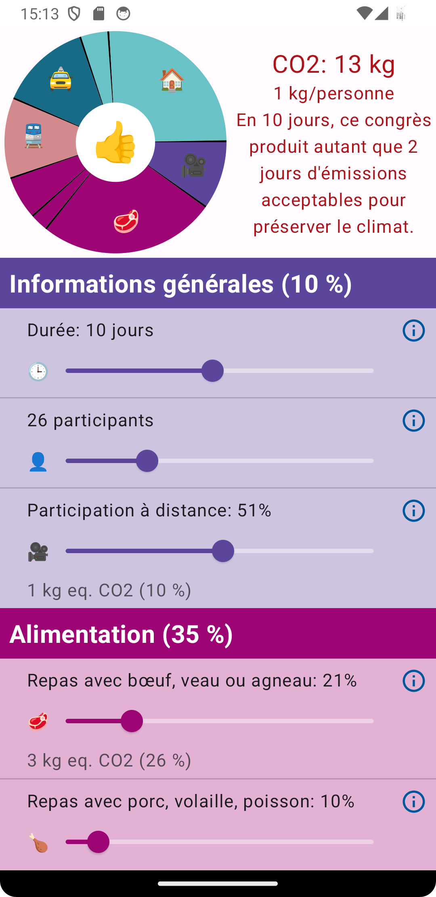
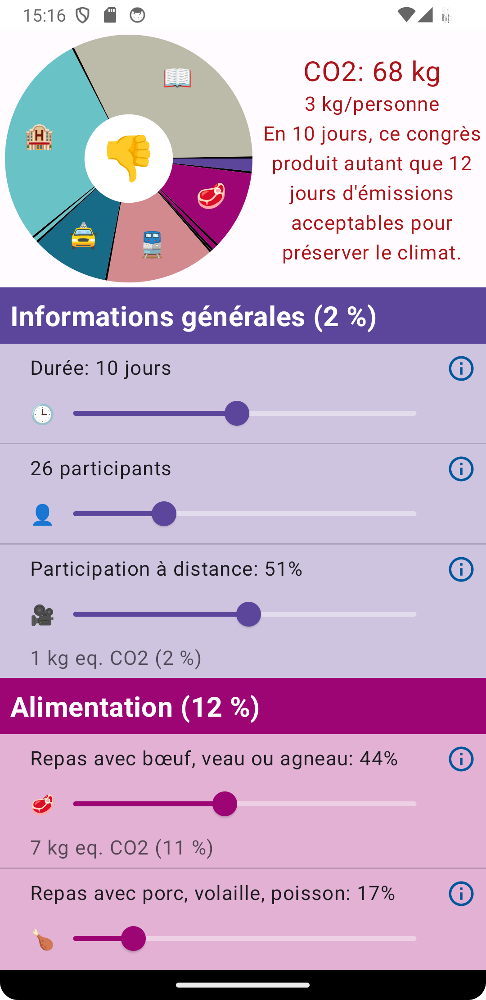

# Application informatique 02 - Bilan CO2

## Description
Portage d'une application iOS (Bilan CO2) vers Android.

Ecrit en Kotlin avec Android Studio à l'aide du framework Jetpack Compose.

## Images

 
 

## Auteurs et reconnaissance
Imad Eddine Bouibed - Développeur \
Liam Burke - Développeur

Prof. Jérome Kasparian - Développeur de l'application iOS sur laquelle celle-ci est basée

Prof. Roland Bouffanais - Superviseur du projet

## Statut du projet
Sous-optimal et incomplet en terme de modes, mais fonctionnel en mode Organisateur de congrès.
